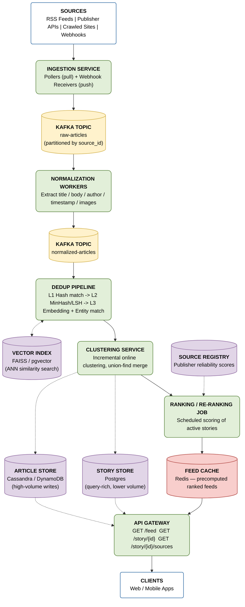
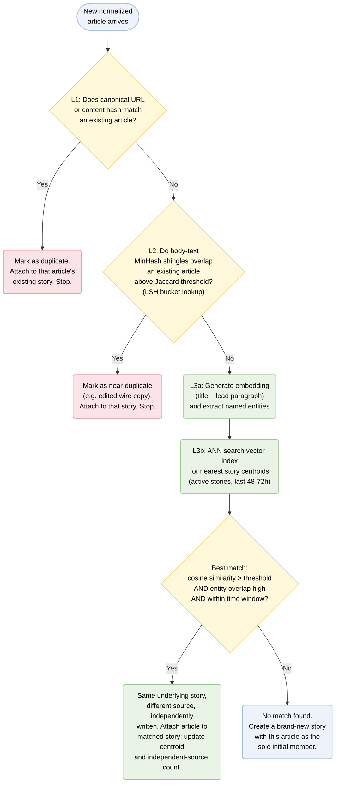

# hld flow :

```mermaid
flowchart TD
    %% Nodes
    Sources["<b>SOURCES</b><br/>RSS Feeds | Publisher APIs | Crawled Sites | Webhooks"]
    Ingestion("<b>INGESTION SERVICE</b><br/>Pollers (pull) + Webhook Receivers (push)")
    KafkaRaw[("<b>KAFKA TOPIC</b><br/>raw-articles<br/>(partitioned by source_id)")]
    NormWorkers("<b>NORMALIZATION WORKERS</b><br/>Extract title / body / author / timestamp / images")
    KafkaNorm[("<b>KAFKA TOPIC</b><br/>normalized-articles")]
    Dedup("<b>DEDUP PIPELINE</b><br/>L1 Hash match -> L2 MinHash/LSH -> L3 Embedding + Entity match")
    VectorIndex[("<b>VECTOR INDEX</b><br/>FAISS / pgvector<br/>(ANN similarity search)")]
    Clustering("<b>CLUSTERING SERVICE</b><br/>Incremental online clustering, union-find merge")
    StoryStore[("<b>STORY STORE</b><br/>Postgres<br/>(query-rich, lower volume)")]
    ArticleStore[("<b>ARTICLE STORE</b><br/>Cassandra / DynamoDB<br/>(high-volume writes)")]
    Ranking("<b>RANKING / RE-RANKING JOB</b><br/>Scheduled scoring of active stories")
    SourceRegistry[("<b>SOURCE REGISTRY</b><br/>Publisher reliability scores")]
    FeedCache[("<b>FEED CACHE</b><br/>Redis — precomputed ranked feeds")]
    ApiGateway("<b>API GATEWAY</b><br/>GET /feed&nbsp;&nbsp;GET /story/{id}&nbsp;&nbsp;GET /story/{id}/sources")
    Clients["<b>CLIENTS</b><br/>Web / Mobile Apps"]

    %% Primary Pipeline (Solid)
    Sources --> Ingestion
    Ingestion --> KafkaRaw
    KafkaRaw --> NormWorkers
    NormWorkers --> KafkaNorm
    KafkaNorm --> Dedup
    Dedup --> Clustering
    Clustering --> Ranking
    Ranking --> FeedCache
    FeedCache --> ApiGateway
    ApiGateway --> Clients

    %% Data Access & External Stores (Dashed)
    Dedup <.-> VectorIndex
    Clustering -.-> StoryStore
    Clustering -.-> ArticleStore
    SourceRegistry -.-> Ranking
    StoryStore -.-> ApiGateway
    ArticleStore -.-> ApiGateway

    %% Styling Classes
    classDef blueBox fill:#ffffff,stroke:#3b73a9,stroke-width:1.5px,color:#000,rx:5px,ry:5px;
    classDef greenBox fill:#e2efd9,stroke:#5f8845,stroke-width:1.5px,color:#000,rx:10px,ry:10px;
    classDef yellowCyl fill:#fff2cc,stroke:#d6b656,stroke-width:1.5px,color:#000;
    classDef purpleCyl fill:#e1d5e7,stroke:#9673a6,stroke-width:1.5px,color:#000;
    classDef redCyl fill:#f8cecc,stroke:#b85450,stroke-width:1.5px,color:#000;

    %% Apply Styles
    class Sources,Clients blueBox;
    class Ingestion,NormWorkers,Dedup,Clustering,Ranking,ApiGateway greenBox;
    class KafkaRaw,KafkaNorm yellowCyl;
    class VectorIndex,StoryStore,ArticleStore,SourceRegistry purpleCyl;
    class FeedCache redCyl;

```

# flow chart : 

```mermaid
flowchart TD
    %% Nodes
    Start(["New normalized<br/>article arrives"])
    
    L1{"L1: Does canonical URL<br/>or content hash match<br/>an existing article?"}
    
    StopDup("Mark as duplicate.<br/>Attach to that article's<br/>existing story. Stop.")
    
    L2{"L2: Do body-text<br/>MinHash shingles overlap<br/>an existing article<br/>above Jaccard threshold?<br/>(LSH bucket lookup)"}
    
    StopNearDup("Mark as near-duplicate<br/>(e.g. edited wire copy).<br/>Attach to that story. Stop.")
    
    L3a("L3a: Generate embedding<br/>(title + lead paragraph)<br/>and extract named entities")
    
    L3b("L3b: ANN search vector index<br/>for nearest story centroids<br/>(active stories, last 48-72h)")
    
    BestMatch{"Best match:<br/>cosine similarity > threshold<br/>AND entity overlap high<br/>AND within time window?"}
    
    SameStory("Same underlying story,<br/>different source, independently<br/>written. Attach article to<br/>matched story; update centroid<br/>and independent-source count.")
    
    NewStory("No match found.<br/>Create a brand-new story<br/>with this article as the<br/>sole initial member.")

    %% Edges
    Start --> L1
    L1 -- Yes --> StopDup
    L1 -- No --> L2
    L2 -- Yes --> StopNearDup
    L2 -- No --> L3a
    L3a --> L3b
    L3b --> BestMatch
    BestMatch -- Yes --> SameStory
    BestMatch -- No --> NewStory

    %% Styling Classes (Matching the image colors)
    classDef blueNode fill:#eef3fb,stroke:#9eb9de,stroke-width:1.5px,color:#000;
    classDef yellowNode fill:#fff8db,stroke:#eed47e,stroke-width:1.5px,color:#000;
    classDef pinkNode fill:#fbe4e7,stroke:#e199a0,stroke-width:1.5px,color:#000;
    classDef greenNode fill:#eaf4e6,stroke:#a3cd9b,stroke-width:1.5px,color:#000;

    %% Apply Styles
    class Start,NewStory blueNode;
    class L1,L2,BestMatch yellowNode;
    class StopDup,StopNearDup pinkNode;
    class L3a,L3b,SameStory greenNode;
    
``` 